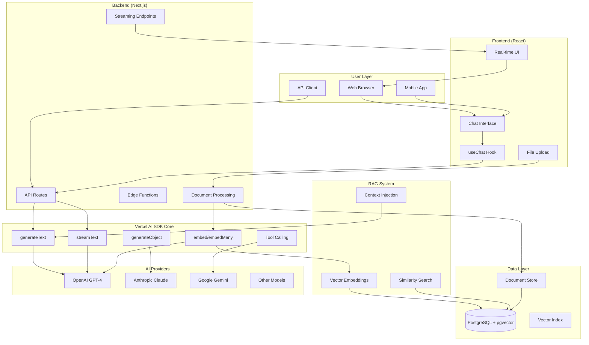
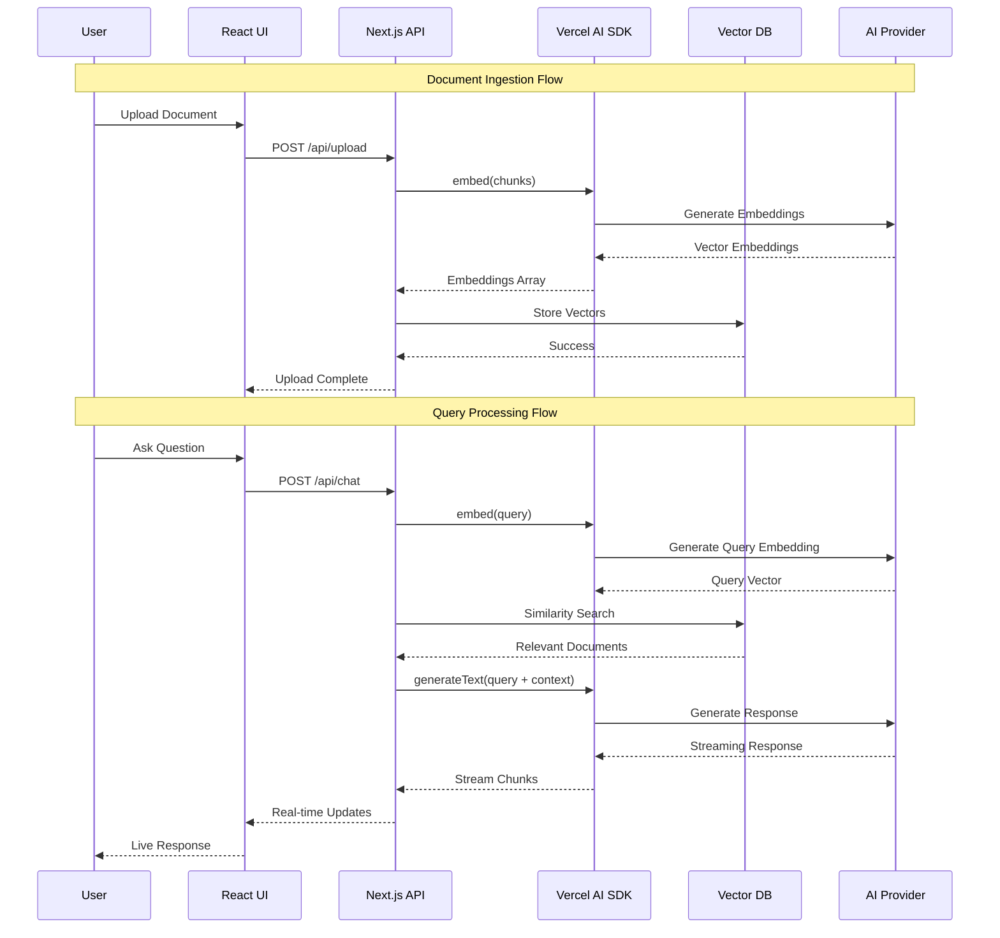
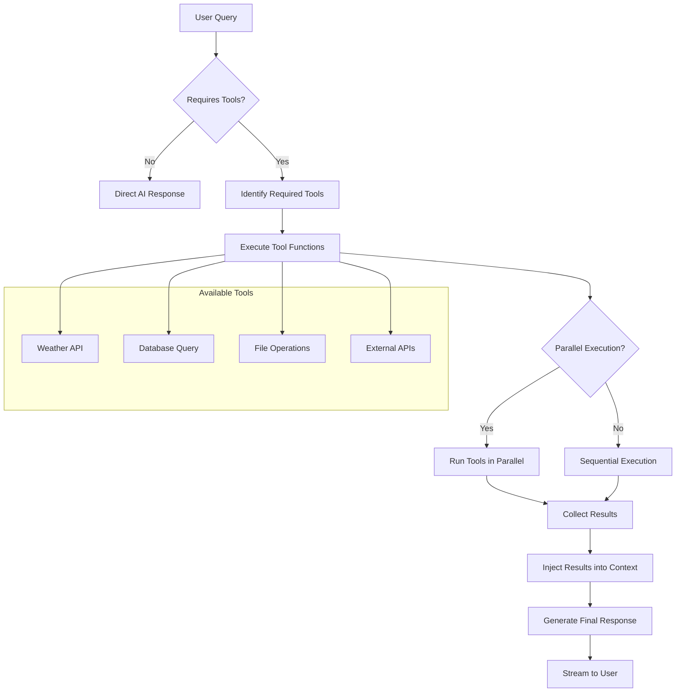
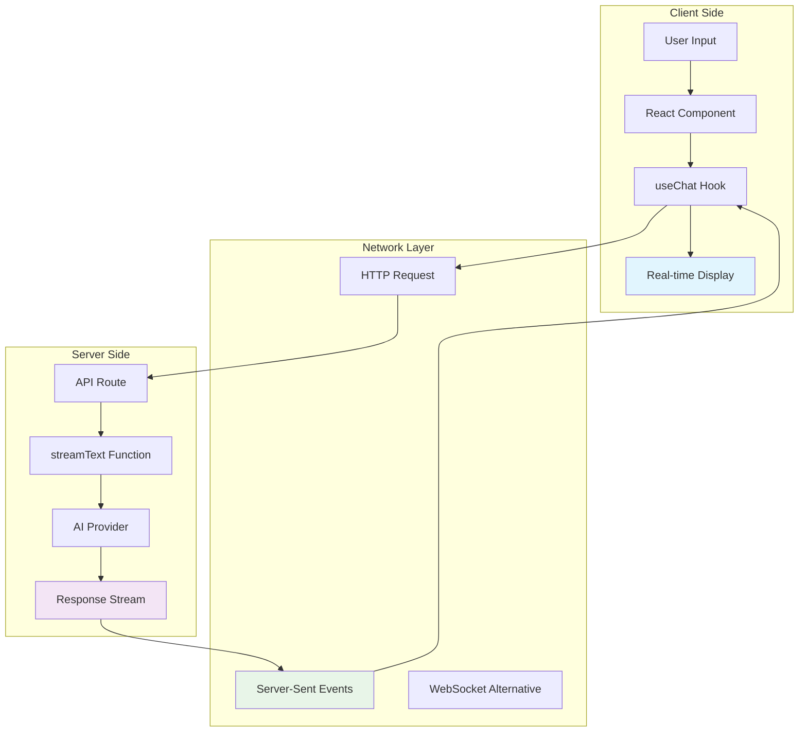
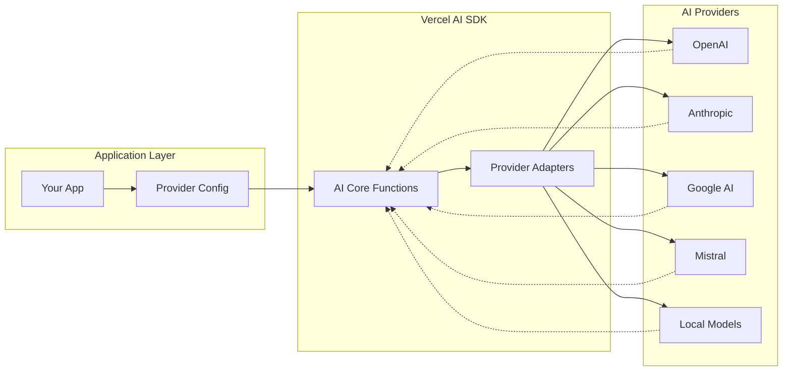
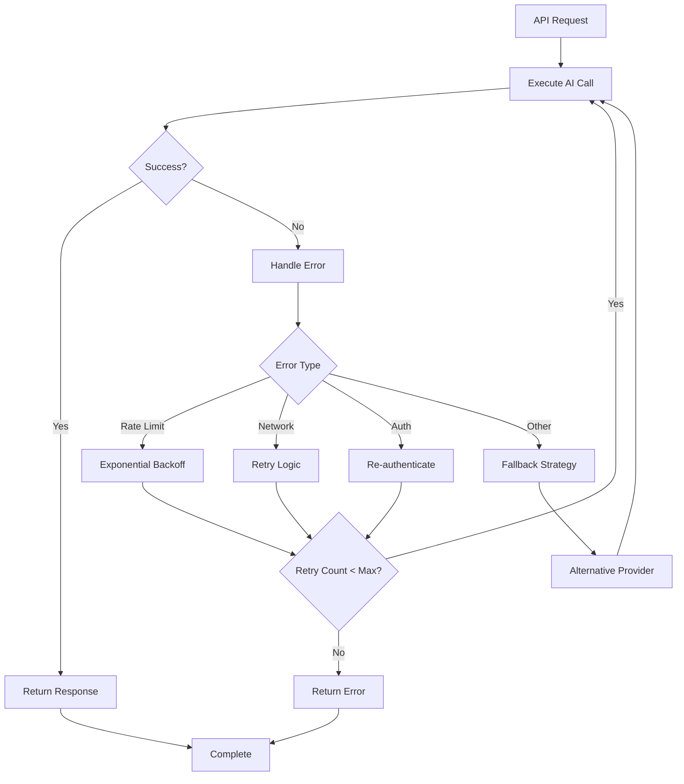
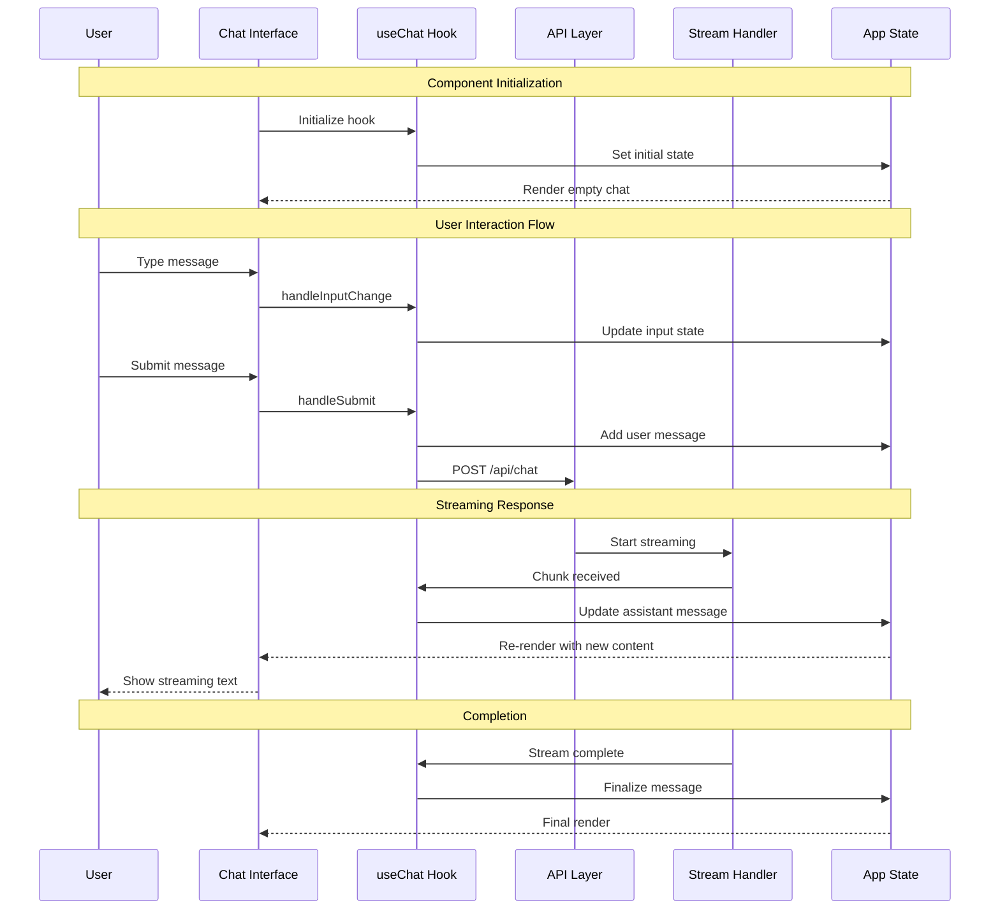
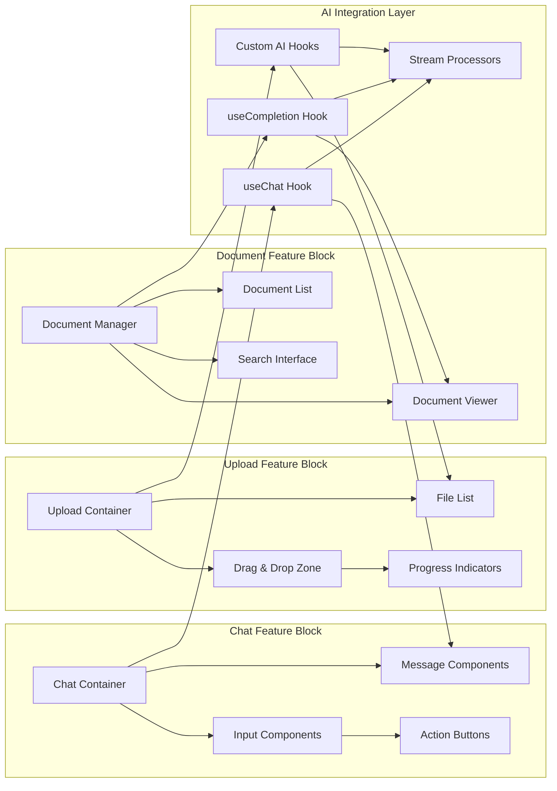
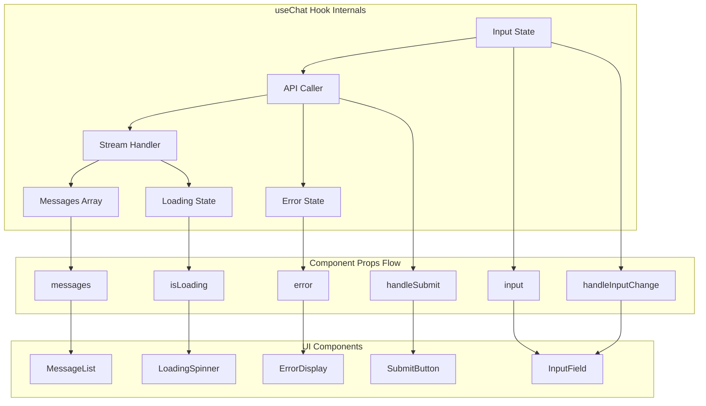
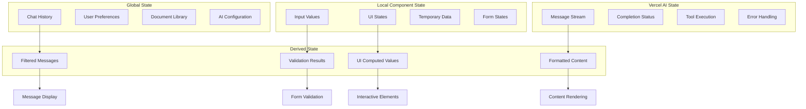

# Vercel AI SDK Architecture Diagrams

This document contains visual representations of the Vercel AI SDK solution architecture, data flows, and component relationships.

## 1. Complete Solution Overview



## 2. RAG Data Flow Architecture



## 3. Component Integration Architecture

```mermaid
graph LR
    subgraph "Frontend Components"
        Chat[Chat Component]
        Upload[File Upload]
        Messages[Message List]
    end
    
    subgraph "React Hooks"
        useChat[useChat Hook]
        useCompletion[useCompletion]
        useAssistant[useAssistant]
    end
    
    subgraph "API Layer"
        ChatAPI[/api/chat]
        UploadAPI[/api/upload]
        EmbedAPI[/api/embed]
    end
    
    subgraph "AI SDK Functions"
        generateText[generateText]
        streamText[streamText]
        embed[embed]
        generateObject[generateObject]
    end
    
    subgraph "External Services"
        OpenAI[OpenAI API]
        Database[(PostgreSQL)]
        Storage[File Storage]
    end
    
    Chat --> useChat
    Upload --> UploadAPI
    useChat --> ChatAPI
    
    ChatAPI --> streamText
    UploadAPI --> embed
    EmbedAPI --> embed
    
    streamText --> OpenAI
    embed --> OpenAI
    generateText --> OpenAI
    
    embed --> Database
    UploadAPI --> Storage
    
    useChat --> Messages
    streamText --> useChat
```

## 4. Tool Calling & Function Execution Flow



## 5. Streaming Architecture



## 6. Multi-Provider Architecture



## 7. Error Handling & Retry Logic



## Usage Notes

### Mermaid Diagrams
The diagrams above use Mermaid syntax and can be rendered in:
- GitHub (native support)
- GitLab (native support)
- VS Code (with Mermaid extension)
- Online editors like [Mermaid Live Editor](https://mermaid.live/)

### ASCII Diagrams
For environments that don't support Mermaid, refer to the ASCII diagrams in the main [capabilities documentation](./vercel-ai-capabilities.md#solution-architecture).

## 8. React App Internal Architecture with Vercel AI

```mermaid
graph TB
    subgraph "React Application Structure"
        subgraph "Pages & Routing"
            HomePage[Home Page]
            ChatPage[Chat Page]
            UploadPage[Upload Page]
            SettingsPage[Settings Page]
        end
        
        subgraph "Feature Components"
            ChatInterface[Chat Interface]
            MessageList[Message List]
            InputForm[Input Form]
            FileUpload[File Upload]
            DocumentViewer[Document Viewer]
            LoadingStates[Loading States]
        end
        
        subgraph "Vercel AI Hooks"
            useChat[useChat Hook]
            useCompletion[useCompletion Hook]
            useAssistant[useAssistant Hook]
            useObject[useObject Hook]
        end
        
        subgraph "State Management"
            ChatState[Chat State]
            DocumentState[Document State]
            UIState[UI State]
            ErrorState[Error State]
        end
        
        subgraph "API Communication"
            ChatAPI[/api/chat]
            UploadAPI[/api/upload]
            DocumentAPI[/api/documents]
            EmbedAPI[/api/embed]
        end
        
        subgraph "Utility Functions"
            FileProcessor[File Processor]
            MessageFormatter[Message Formatter]
            ErrorHandler[Error Handler]
            StreamHandler[Stream Handler]
        end
    end
    
    HomePage --> ChatPage
    ChatPage --> ChatInterface
    ChatInterface --> MessageList
    ChatInterface --> InputForm
    
    InputForm --> useChat
    FileUpload --> UploadAPI
    useChat --> ChatAPI
    
    useChat --> ChatState
    ChatState --> MessageList
    
    FileUpload --> FileProcessor
    FileProcessor --> DocumentState
    
    ChatAPI --> StreamHandler
    StreamHandler --> useChat
    
    ErrorHandler --> ErrorState
    ErrorState --> LoadingStates
```

## 9. React Component Communication Flow



## 10. Feature Block Architecture



## 11. React Hook Communication Patterns



## 12. State Management & Data Flow



### Integration Examples
Each diagram corresponds to implementation examples in the main documentation. Use these visual guides alongside the code examples for better understanding of the system architecture.

## React App Implementation Guide

### Key Feature Blocks in a Vercel AI React App:

#### 1. **Chat Interface Block**
- Message display components
- Input handling with `useChat`
- Real-time streaming updates
- Message history management

#### 2. **File Upload Block**
- Drag & drop functionality
- File processing pipeline
- Progress tracking
- Document embedding workflow

#### 3. **Document Management Block**
- Document library interface
- Search and filter capabilities
- Document viewer integration
- Metadata management

#### 4. **AI Integration Block**
- Hook-based AI interactions
- Stream processing
- Error handling
- Multi-provider support

### Communication Patterns:

1. **Hook-to-Component**: Vercel AI hooks provide state and handlers to React components
2. **Component-to-API**: Components trigger API calls through hook methods
3. **Stream-to-UI**: Real-time updates flow from API streams to UI components
4. **State-to-State**: Global and local state synchronization for consistent UX
